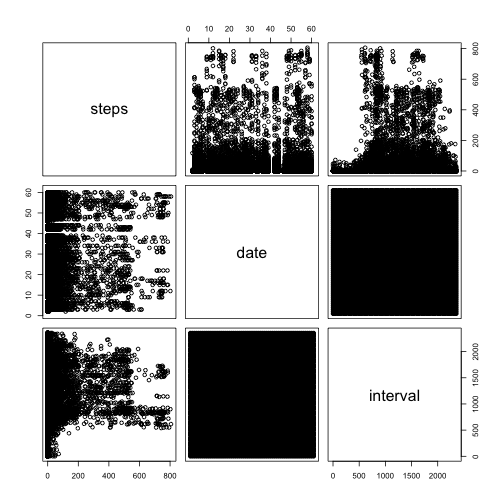
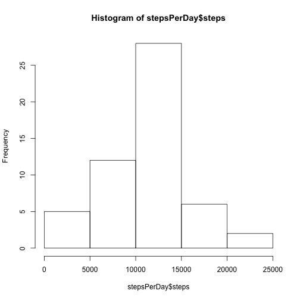
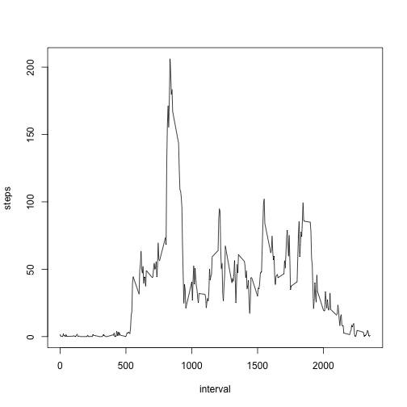
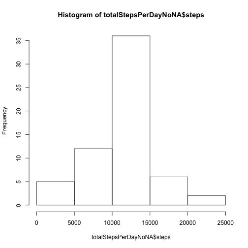
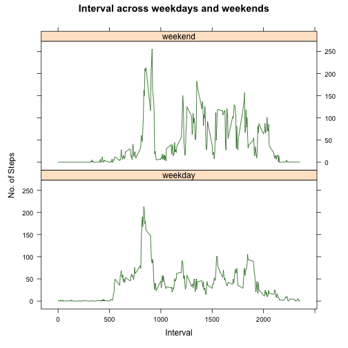

---
title: "RepData_PeerAssessment-1-Activity Data"
author: "GM@2021"
date: "Date: 13 10 2021"
output: html_document
---


#### 1.Code for reading in the dataset and/or processing the data


```r
# Check data Dir if exists
if(!file.exists("./data")){dir.create("./data")}
# download and unzip data
dataUrl<-"https://d396qusza40orc.cloudfront.net/repdata%2Fdata%2Factivity.zip"
destfile<-"/Users/Quito/OneDrive/Coursera/ReproductibleResearch/ReproducibleResearchPeerAssessment-1/data/repdata-data-activity.zip"
download.file(dataUrl,destfile)

unzip("/Users/Quito/OneDrive/Coursera/ReproductibleResearch/ReproducibleResearchPeerAssessment-1/data/repdata-data-activity.zip",exdir="data") #unzip
# store data in new variable
activityData <- read.csv("./data/activity.csv")
```
#### Show summary 


```r
summary(activityData)
```

```
##      steps                date          interval     
##  Min.   :  0.00   2012-10-01:  288   Min.   :   0.0  
##  1st Qu.:  0.00   2012-10-02:  288   1st Qu.: 588.8  
##  Median :  0.00   2012-10-03:  288   Median :1177.5  
##  Mean   : 37.38   2012-10-04:  288   Mean   :1177.5  
##  3rd Qu.: 12.00   2012-10-05:  288   3rd Qu.:1766.2  
##  Max.   :806.00   2012-10-06:  288   Max.   :2355.0  
##  NA's   :2304     (Other)   :15840
```
#### show names and head of data


```r
names(activityData)
```

```
## [1] "steps"    "date"     "interval"
```

```r
head(activityData)
```

```
##   steps       date interval
## 1    NA 2012-10-01        0
## 2    NA 2012-10-01        5
## 3    NA 2012-10-01       10
## 4    NA 2012-10-01       15
## 5    NA 2012-10-01       20
## 6    NA 2012-10-01       25
```
#### plot graphics from activity data 


```r
pairs(activityData)
```




#### 2. Histogram of the total number of steps taken each day

```r
stepsPerDay <- aggregate(steps ~ date, activityData, sum, na.rm=TRUE)
hist(stepsPerDay$steps)
```



#### 3. Calculate and report the mean and median of the total number of steps taken per day

- mean Steps per Day

```r
meanStepsPerDay <- mean(stepsPerDay$steps)
meanStepsPerDay
```

```
## [1] 10766.19
```
- median Steps per Day


```r
medianStepsPerDay <- median(stepsPerDay$steps)
medianStepsPerDay
```

```
## [1] 10765
```

#### 4. Time series plot of the average numbers of steps taken
- make time series plot of the 5-minute interval (x-axis) and the average number of steps taken, 
averaged across all days (y-axis) 


```r
stepsPerInterval<-aggregate(steps~interval, data=activityData, mean, na.rm=TRUE)
plot(steps~interval, data=stepsPerInterval, type="l")
```



#### 5. The 5-minute interval that, on average, contains the maximum number of steps


```r
intervalWithMaxNbSteps <- stepsPerInterval[which.max(stepsPerInterval$steps),]$interval
intervalWithMaxNbSteps
```

```
## [1] 835
```

#### 6. Code to describe and show a strategy for imputing missing data
- calculate the total number of missing values in data and store it to var=totalValuesMissing


```r
totalValuesMissings <- sum(is.na(activityData$steps))
totalValuesMissings
```

```
## [1] 2304
```

```r
# fill in all missing values in the dataset with the mean per interval. 
getMeanStepsPerInterval<-function(interval){
    stepsPerInterval[stepsPerInterval$interval==interval,]$steps}
# Create a new dataset (var=activityDataNoNA) that is equal to the original include the mean per interval
activityDataNoNA<-activityData
for(i in 1:nrow(activityDataNoNA)){
    if(is.na(activityDataNoNA[i,]$steps)){
        activityDataNoNA[i,]$steps <- getMeanStepsPerInterval(activityDataNoNA[i,]$interval)
          }
        }
```

##### 7. Histogram of the total number of steps taken each day after missing values are imputed


```r
totalStepsPerDayNoNA <- aggregate(steps ~ date, data=activityDataNoNA, sum)
hist(totalStepsPerDayNoNA$steps)
```



##### 8. Panel plot comparing the average number of steps taken per 5-minute interval across weekdays and weekends


```r
# create var with two criteria – weekday and weekend 

activityDataNoNA$date <- as.Date(strptime(activityDataNoNA$date, format="%Y-%m-%d"))
activityDataNoNA$day <- weekdays(activityDataNoNA$date, abbreviate = FALSE)
for (i in 1:nrow(activityDataNoNA)) {
    if (activityDataNoNA[i,]$day %in% c("Samstag","Sontag")) {
        activityDataNoNA[i,]$day<-"weekend"
    }
    else{
        activityDataNoNA[i,]$day<-"weekday"
    }
}

stepsByDay <- aggregate(activityDataNoNA$steps ~ activityDataNoNA$interval + activityDataNoNA$day, activityDataNoNA, mean)

# aggregate steps+interval+day bay mean
stepsByDay <- aggregate(activityDataNoNA$steps ~ activityDataNoNA$interval + activityDataNoNA$day, activityDataNoNA, mean)
names(stepsByDay) <- c("interval", "day", "steps")
```

#### Panel Plot


```r
# load library
library(lattice)
# panel plot the results
xyplot(steps ~ interval | day, stepsByDay, type = "l", col="darkgreen", layout = c(1, 2), 
    xlab = "Interval", ylab = "No. of Steps", main ="Interval across weekdays and weekends")
```



